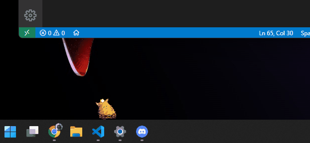

# desktop-pet



Desktop pet using Python. Sprites in the assets folder are stolen from Nitrome. This project is based off of [this Medium post](https://medium.com/analytics-vidhya/create-your-own-desktop-pet-with-python-5b369be18868) but the code in that post is highly inflexible and a lot of things are hard coded.

My project has:
* Easy modification using JSON files
* OpenAI GPT support to turn your little friend into a helper that can answer your questions

## How to use

### Creating a pet config

Create a folder with a JSON file named `config.json` describing the pet, and all the gifs for your pet. The specifics of this JSON file are explained later. You can simply take one of the example configs I made in the `/assets/` folder in this repo. 

### Running the program

Clone this repo and run main.py OR download my totally safe exe (windows) or zip file (which macOS uses apparently?)

Run it like this: `python main.py /path/to/your/config/folder/` or `& '.\desktop-pet.exe' C:\path\to\your\config\folder\`

Suppose I downloaded the EXE and the `cave_chaos` folder from this repo. I put the `cave_chaos` folder in the same directory as the EXE. I can run it like this:

`& '.\desktop-pet.exe' cave_chaos\`

### How to close

You can't close this program. That's not implemented yet. Just restart your PC or terminate the program in task manager. Sorry :)

## How to get sprites from Nitrome (or any Flash game)

Get an SWF file from here:
https://archive.org/details/all_nitrome_games

Then decompile it using this tool
https://github.com/jindrapetrik/jpexs-decompiler
and extract all the image files. You can create gifs using ezgif or something.

## How to create your own pets

Basically, pets are finite state machines. The states and transitions are defined in the JSON file.


```json
{
    "state_name": "miner_tired",
    "frames": 7,
    "dims": [0, 0, 45, 50],
    "move": [2, 0],
    "file_name": "miner_idle.gif",
    "transitions_to": [
        {
            "name": "miner_tired",
            "probability": 0.8
        },
        {
            "name": "miner_sleeping",
            "probability": 0.2
        }
    ]
},
```

This is an example of a state definition.
"frames" is the number of frames in the gif.
"dims" is x offset, y offset, and the width and height of the gif. (if x offset is X, it will shift the image X relative to the pet's real position).
"move" means that each frame, the pet will move x, y pixels (this is useful for walking states).
